# 服务器前端搭建+nodejs应用容器化Docker部署
------

## 负责成员：16340244伍宇阳

----
## 主要内容
- 利用angular框架，设置页面为包括登陆界面，人物总览界面和人物细节界面三个界面
- 使用授权访问方式，访问特定资源需要登录处理
- 使用restful接口，接口设计模仿https://swapi.co/
- ps:nodejs应用容器化Docker部署部分在文末

## 运行安装

- 进入myAngular文件夹，在安装angular-cli之后执行如下命令即可运行
```
ng serve --open
```


## 项目组成
- 架构技术细节参考https://angular.cn/guide
- 使用angular框架，架构内容包括多个componenet和service
- 总的文件组成   

    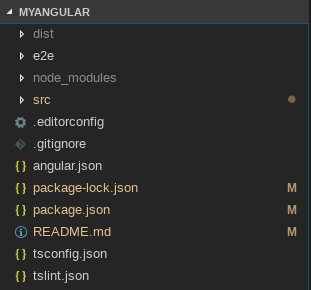  

- 主要文件在/src/app  
    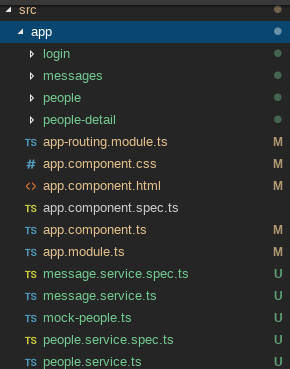
- 以people组件为例，一个组件包括四个文件，其他组件类似  
    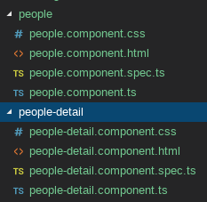

## 运行界面
- 主界面  

    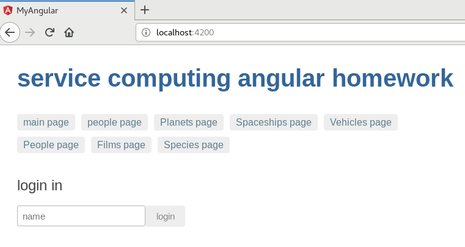  

- 各个子界面的导航栏  

      

- 登录窗口  

    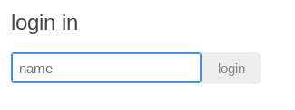  

- 点击进入人物栏，显示所有人物姓名和性别  

    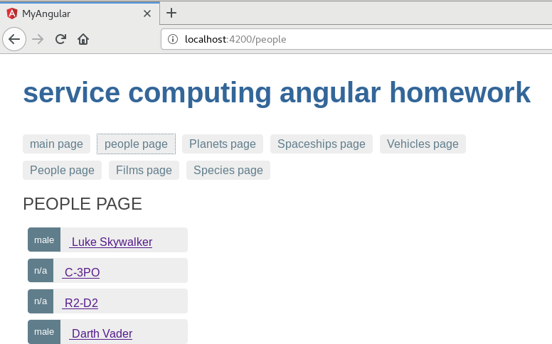  

- 界面下拉，所有人物都显示  

    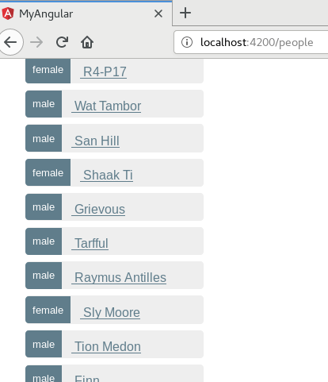  

- 查看调试窗口，可以看见多页加载的情况  

    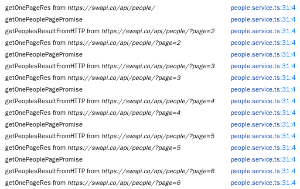
    .png)  

- 点击人物，显示对应的任务详情界面  

    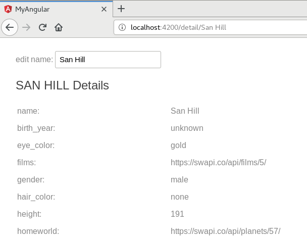
    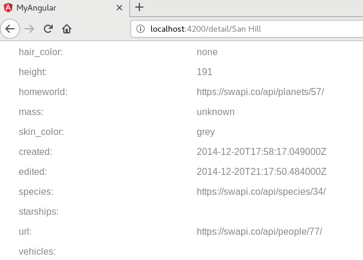
    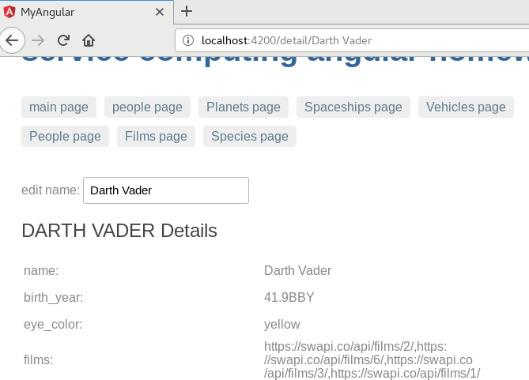  


## 心得感悟
- service类通过注入依赖的方式实现单例模式。例如下面多个componnent中：
    ```ts
    //detail.component
    constructor(heroService: HeroService)
    ```
    ```ts
    //people.component
    constructor(heroService: HeroService)
    ```
    - 这里的构造函数里面并不是构造多个service的实例，而是注入依赖的意思，如果之前没有实例化这个service，则实例化，否则获取已经实例化的service。
    - 使用service可以提高模块性和复用性。 通过把组件中和视图有关的功能与其他类型的处理分离开。组件把诸如从服务器获取数据、验证用户输入或直接往控制台中写日志等工作委托给各种服务。通过把各种处理任务定义到可注入的服务类中，可以让它被任何组件使用。 通过在不同的环境中注入同一种服务的不同提供商，还可以让你的应用更具适应性。
    - 总的来说，service可以用来处理组件的数据处理，数据共享等等，重要的是，service是单例模式。
- 组件的使用是另一个重要的部分。组件可以控制屏幕上被称为视图的一小片区域。
    - 组件由html模板，css和控制文件component.ts构成，可以通过诸如：
    ```ts
    <app-hero-detail *ngIf="selectedHero" [hero]="selectedHero"></app-hero-detail>
    ```
    - 的方式隐藏或者显示组件，而无须刷新整个界面。同时由于使用的是模板，因此可以实时修改其中的数据内容，达到动态修改界面的效果。
    - 按照教程，最好是将组件细分，避免太多显示内容集中于同一个组件，否则灵活性和逻辑性难以体现。
- 表单提取也和普通的html不同，有专门的语言如下:
    ```html
    <form [formGroup]="profileForm">
  
    <label>
        First Name:
        <input type="text" formControlName="firstName">
    </label>

    <label>
        Last Name:
        <input type="text" formControlName="lastName">
    </label>

    </form>
    ```
    - 获取表单内容方式如下：
    ```ts
    import { Component } from '@angular/core';
    import { FormGroup, FormControl } from '@angular/forms';
    
    @Component({
    selector: 'app-profile-editor',
    templateUrl: './profile-editor.component.html',
    styleUrls: ['./profile-editor.component.css']
    })
    export class ProfileEditorComponent {
        profileForm = new FormGroup({
            firstName: new FormControl(''),
            lastName: new FormControl(''),
        });
    }
    ```
- 路由与导航：
    - 跳转至预先设定的url:
    ```html
    <h1>Angular Router</h1>
    <nav>
    <a routerLink="/crisis-center" routerLinkActive="active">Crisis Center</a>
    <a routerLink="/heroes" routerLinkActive="active">Heroes</a>
    </nav>
    <router-outlet></router-outlet>
    ```
    - 跳转至动态设置的url:
    ```html
    <ul class="peoples">
    <li *ngFor="let people of peoples">
    <a routerLink="/detail/{{people.name}}">
    <span class="badge" >{{people.gender}}</span> {{people.name}}
    </a>
    </li>
    </ul>
    ```
    - 根据URL获取内容
    ```ts
    getHero():void{
        const name=this.route.snapshot.paramMap.get('name');
        this.peopleService.getPeople(name).subscribe(people=>this.people=people);
    }
    ```

- 以获取人物界面为例,分页获取，使用restful接口
    ```ts
    getPeoples():Observable<People[]>{
        this.peoples=[];
        this.log("start to get peoples");

        /*用于获取连页数据*/
        this.getPeoplesResultFromHTTP(this.url).then(
            result=>this.log("finish by url:"+result));
        return of(this.peoples);
    }

    /*将从HTTP获取单页信息函数转为promise*/
    getOnePeoplePagePromise(urlThis:string): Promise<{}>{
        //this.log("start promise");
        return new Promise((resolve,reject)=>{//绑定this,不用function(resolve,reject)
        //this.log("start new promise");
        //异步耗时操作
        this.getOnePageRes(urlThis).subscribe(peopleResult=>{
            this.log("getOnePeoplePagePromise");
            this.url=peopleResult.next;
            peopleResult.results.forEach(people=>{
            this.peoples.push(people);
            })
            resolve(this.url);
        });
        });
    }
  
    /*此函数用于从HTTP获取单页信息*/
    getOnePageRes(url:string):Observable<PeopleResult>{
        /*暂不添加this.httpOptions*/
        return this.http.get<PeopleResult>(url).pipe(
            tap(peopleResult => this.log("getOnePageRes from "+url)),
            catchError(this.handleError<PeopleResult>("getOnePageRes"))//不要忘了<PeopleResult>
        );
    }

    /*用于链式调用getOnePeoplePagePromise,采用递归的方式*/
    getPeoplesResultFromHTTP(url:string):Promise<{}>{
        this.log("getPeoplesResultFromHTTP from "+url)
        if(url!==null){
        return this.getOnePeoplePagePromise(url).then(
            _ =>{
            return this.getPeoplesResultFromHTTP(this.url);
            }
        )
        }else{
        return Promise.resolve(this.url);
        }
    }

    getPeople(name:string):Observable<People>{
        var url=this.peoples.find(people=>people.name===name).url;
        /*暂不添加this.httpOptions*/
        return this.http.get<People>(url).pipe(
        tap(_=>this.log("get detail of "+name)),
        catchError(this.handleError<People>("getPeople"))
        );
    }
  
    /**
    * Handle Http operation that failed.
    * Let the app continue.
    * @param operation - name of the operation that failed
    * @param result - optional value to return as the observable result
    */
    private handleError<T> (operation = 'operation', result?: T) {
    return (error: any): Observable<T> => {
        // TODO: send the error to remote logging infrastructure
        console.error(error); // log to console instead
        // TODO: better job of transforming error for user consumption
        this.log(`${operation} failed: ${error.message}`);
        // Let the app keep running by returning an empty result.
        return of(result as T);
    };
    }
    ```
## 调试细节
 
 - no-provider-for-activatedroute:
    - https://stackoverflow.com/questions/38942817/no-provider-for-activatedroute-angular-2-rc5 

- angular-2-router-no-base-href-set:
    - https://stackoverflow.com/questions/34535163/angular-2-router-no-base-href-set

- angular-2-and-observables-cant-bind-to-ngmodel-since-it-isnt-a-known-prope:
    - https://stackoverflow.com/questions/38983766/angular-2-and-observables-cant-bind-to-ngmodel-since-it-isnt-a-known-prope
    
## Docker配置nodejs应用
- 生成镜像
    - 参考教程：https://www.cnblogs.com/pass245939319/p/8473861.html
    - 总流程：
        - 准备好nodejs程序(如angular)
        - 写好dockerignore和Dockerfile
        - 生成镜像
        - 上传至docker hub  
    - Dockerfile
    ```
    #制定node镜像的版本
    FROM registry.docker-cn.com/library/node:8.9-alpine
    #声明作者
    MAINTAINER AlanWu
    #移动当前目录下面的文件到app目录下
    ADD . /app/
    #进入到app目录下面，类似cd
    WORKDIR /app
    #安装依赖
    RUN npm install
    #对外暴露的端口
    EXPOSE 4200
    #程序启动脚本
    CMD ["npm", "start"]
    ```
    - 生成的镜像仓库：https://cloud.docker.com/repository/docker/wuyy1234/wyy_angular_demo

- 部署
    - 参考教程：https://www.cnblogs.com/li-peng/p/8144372.html
    - docker-compose.yml
    ```
    version: "3"
    services:
      web:
        image: wuyy1234/wyy_angular_demo
        deploy:
          replicas: 5
          resources:
            limits: 
              cpus: "0.1"
              memory: 50M
          restart_policy:
            condition: on-failure
        ports:
          - "8111:4200"
        networks: 
          - gowebnet
    networks: 
      gowebnet:
    ```
    - 运行情况
    ```
    root@VM-28-58-ubuntu:/home/ubuntu/code/docker_wyy/myAngular# docker stack deploy -c docker-compose.yml myA                                 ngular
    Creating network myAngular_gowebnet
    Creating service myAngular_web
    root@VM-28-58-ubuntu:/home/ubuntu/code/docker_wyy/myAngular# docker service ls
    ID                  NAME                MODE                REPLICAS            IMAGE                                                               PORTS
    oxayidnuid2m        myAngular_web       replicated          5/5                 wuyy1234/wyy_angular_demo:                                 latest   *:8111->4200/tcp
    ```
    
    
